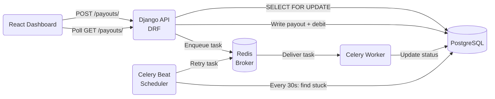

# EXPLAINER.md — Playto Payout Engine

---

## System Overview

Playto Pay solves a real infrastructure gap: Indian agencies and freelancers cannot access Stripe or PayPal, yet need to collect USD from international clients and receive INR in their bank accounts. The payout engine is the core of that flow — it is the system that holds merchant funds, validates withdrawal requests, and drives money to Indian bank accounts reliably.

**Three guarantees the system must never break:**

| Guarantee | What it means |
|---|---|
| **No double-spend** | A merchant with ₹100 cannot withdraw ₹60 twice simultaneously |
| **Consistency** | The ledger balance always equals the sum of all credits minus debits |
| **Idempotency** | Retrying a failed network request never creates a duplicate payout |

Payouts are processed asynchronously because bank settlement APIs are slow, unreliable, and can hang indefinitely. A synchronous API that waits for bank confirmation would time out on every real request. The Celery worker layer absorbs that latency and drives the payout through its lifecycle independently of the HTTP request that created it.

---

## Architecture



**Services started by `docker-compose up`:**
- `backend` — Django + DRF on port 8001
- `db` — PostgreSQL 15
- `redis` — Redis 7 (Celery broker + result backend)
- `celery_worker` — processes payout tasks
- `celery_beat` — runs periodic stuck-payout checks
- `frontend` — React + Vite on port 5174

---

## Request Flow

```
1. Client sends POST /api/v1/payouts/
   Headers: Idempotency-Key: <uuid>
   Body:    { merchant_id, amount_paise, bank_account_id }

2. API checks idempotency table
   → Key seen before?  Return stored response (no DB write)
   → Key in-flight?    Return 409
   → New key?          Mark as in-flight, continue

3. API acquires SELECT FOR UPDATE on merchant row
   → Serialises all concurrent requests for this merchant at DB level

4. API aggregates ledger: available = SUM(credits) - SUM(debits)
   → Insufficient funds? Raise error, roll back

5. API writes atomically:
   → Payout row (status: pending)
   → LedgerEntry DEBIT (funds held)
   → IdempotencyKey response stored

6. Celery task dispatched: process_payout(payout_id)

7. Worker transitions: pending → processing
   → Records processing_started_at
   → Simulates ~3s bank settlement

8. Worker transitions: processing → completed
   → No new ledger entry needed (debit was written at step 5)

9. Client polls GET /api/v1/payouts/{id}/ and reflects status
```

---

## 1. The Ledger

**Balance calculation query** (`apps/ledger/services.py`):

```python
result = LedgerEntry.objects.filter(merchant_id=merchant_id).aggregate(
    total_credits=Sum('amount_paise', filter=Q(entry_type=LedgerEntry.CREDIT)),
    total_debits=Sum('amount_paise', filter=Q(entry_type=LedgerEntry.DEBIT)),
)
available = (result['total_credits'] or 0) - (result['total_debits'] or 0)
```

Generated SQL — a single round-trip to the database:

```sql
SELECT
  SUM(amount_paise) FILTER (WHERE entry_type = 'credit') AS total_credits,
  SUM(amount_paise) FILTER (WHERE entry_type = 'debit')  AS total_debits
FROM ledger_entries
WHERE merchant_id = %s;
```

**Design invariant:** balance is never stored as a column. It is always derived from the append-only ledger. This eliminates an entire class of bugs where a stored balance column diverges from reality during crashes, retries, or partial failures.

**Entry lifecycle:**

```
Payout requested  → DEBIT entry written immediately (funds held)
Payout completed  → no new entry needed; the debit is final
Payout failed     → CREDIT entry written atomically with FAILED transition (funds returned)
Customer payment  → CREDIT entry written
```

The invariant `available = SUM(credits) - SUM(debits)` holds at every point in time with no special-casing. There is no concept of "pending balance" stored anywhere — it is derived on-demand.

**Held balance** (informational, shown in dashboard):

```python
held = LedgerEntry.objects.filter(
    merchant_id=merchant_id,
    entry_type=LedgerEntry.DEBIT,
    payout__status__in=[Payout.PENDING, Payout.PROCESSING],
).aggregate(held=Sum('amount_paise'))['held'] or 0
```

---

## 2. The Lock

**Exact code** (`apps/payouts/services.py`):

```python
@transaction.atomic
def create_payout(merchant_id, amount_paise, bank_account_id):
    merchant = Merchant.objects.select_for_update().get(id=merchant_id)

    result = LedgerEntry.objects.filter(merchant_id=merchant_id).aggregate(
        total_credits=Sum('amount_paise', filter=Q(entry_type=LedgerEntry.CREDIT)),
        total_debits=Sum('amount_paise', filter=Q(entry_type=LedgerEntry.DEBIT)),
    )
    available = (result['total_credits'] or 0) - (result['total_debits'] or 0)

    if available < amount_paise:
        raise InsufficientFundsError(...)

    payout = Payout.objects.create(...)
    LedgerEntry.objects.create(entry_type=DEBIT, ...)
    return payout
```

**Database primitive:** PostgreSQL row-level exclusive lock via `SELECT ... FOR UPDATE`.

**Why this works for concurrent requests:**

```
Request A ──► SELECT FOR UPDATE (merchant) ──► acquired ──► read balance=10000 ──► write debit 6000 ──► COMMIT
Request B ──► SELECT FOR UPDATE (merchant) ──► BLOCKS ────────────────────────────────────────────────► wake up ──► read balance=4000 ──► InsufficientFundsError
```

The second request cannot read the ledger until the first transaction commits. By then, the debit is visible and the balance check fails correctly. No overdraft is possible.

**Why application-level locking is insufficient:**

| Approach | Failure mode |
|---|---|
| Python `threading.Lock` | Breaks across multiple Gunicorn workers |
| Redis lock | Network partition can cause both holders to proceed |
| `SELECT FOR UPDATE` on payout rows | Locks non-existent rows — no protection on creation |
| `SELECT FOR UPDATE` on merchant row | Correct — pre-existing shared resource, serialises at DB level |

---

## 3. The Idempotency

**Model** (`apps/idempotency/models.py`):

```python
class IdempotencyKey(models.Model):
    merchant        = models.ForeignKey(Merchant, ...)
    key             = models.CharField(max_length=255)
    is_in_flight    = models.BooleanField(default=False)
    response_status = models.IntegerField()
    response_body   = models.JSONField()

    class Meta:
        unique_together = [['merchant', 'key']]  # DB-level uniqueness guarantee
```

Keys are scoped per merchant and expire after 24 hours (enforced at query time).

**Request flow:**

```
Incoming request with Idempotency-Key header
         │
         ▼
 Key exists in DB?
    ├── YES, is_in_flight=False  →  return stored response (no processing)
    ├── YES, is_in_flight=True   →  return 409 (first request still running)
    └── NO
         │
         ▼
    get_or_create(is_in_flight=True)
         ├── created=False  →  race lost, return 409
         └── created=True
              │
              ▼
         Process payout
              │
              ▼
         Update key: is_in_flight=False, store response_body + response_status
```

**The in-flight flag handles the hardest case:** a client retries mid-request (slow connection, timeout). The second request arrives while the first is inside `create_payout`. The `is_in_flight=True` flag returns 409 instantly without touching the payout table. No duplicate payout is created regardless of how aggressively the client retries.

---

## 4. The State Machine

**Transition map** (`apps/payouts/models.py`):

```python
VALID_TRANSITIONS = {
    'pending':    ['processing'],
    'processing': ['completed', 'failed'],
    'completed':  [],   # terminal
    'failed':     [],   # terminal
}

def transition_to(self, new_status):
    allowed = self.VALID_TRANSITIONS.get(self.status, [])
    if new_status not in allowed:
        raise ValidationError(
            f'Illegal state transition: {self.status} → {new_status}'
        )
    self.status = new_status
```

```
pending ──► processing ──► completed
                      └──► failed
```

`transition_to()` is the **single gatekeeper** for all status changes. There is no other write path to `payout.status`. Terminal states (`completed`, `failed`) have an empty allowed list — any attempt to reopen them raises `ValidationError` and rolls back the transaction.

---

## 5. Failure Handling

**Async lifecycle with retry** (`apps/payouts/tasks.py`):

```
POST /api/v1/payouts/
       │
       ▼
Celery: process_payout(payout_id)
       │
       ├── pending → processing (SELECT FOR UPDATE)
       ├── time.sleep(3)  [simulates bank latency]
       └── processing → completed
```

**Stuck payout recovery** — `check_stuck_payouts` runs every 30 seconds via Celery beat:

```python
stuck_threshold = timezone.now() - timedelta(seconds=30)
stuck = Payout.objects.filter(
    status=Payout.PROCESSING,
    processing_started_at__lt=stuck_threshold,
)
```

For each stuck payout, `retry_stuck_payout` is dispatched:

```
retry_count=0 → backoff 1s  → reset to pending → re-dispatch process_payout
retry_count=1 → backoff 2s  → reset to pending → re-dispatch process_payout
retry_count=2 → backoff 4s  → reset to pending → re-dispatch process_payout
retry_count=3 → max retries → transition to FAILED + write CREDIT refund (atomic)
```

**Atomicity guarantee on failure:**

```python
@transaction.atomic
def fail_payout(payout_id):
    payout = Payout.objects.select_for_update().get(id=payout_id)
    payout.transition_to(Payout.FAILED)
    payout.save(update_fields=['status', 'updated_at'])

    LedgerEntry.objects.create(
        merchant_id=payout.merchant_id,
        entry_type=LedgerEntry.CREDIT,
        amount_paise=payout.amount_paise,
        description=f'Refund for failed payout: {payout.id}',
    )
```

The `FAILED` status and the refund CREDIT are written inside a single `transaction.atomic()`. It is physically impossible to mark a payout failed without refunding, or to refund without marking it failed.

---

## 6. The AI Audit

**What AI generated (wrong locking):**

```python
# WRONG — AI locked the payout queryset, not the merchant row
existing_payouts = Payout.objects.select_for_update().filter(
    merchant_id=merchant_id,
    status__in=['pending', 'processing']
)
held     = existing_payouts.aggregate(total=Sum('amount_paise'))['total'] or 0
available = credits - debits - held
```

**Why it fails:**

`SELECT FOR UPDATE` only locks rows that already exist at query time. When two requests arrive simultaneously, no payout rows exist yet for either of them. Both transactions scan zero rows, both lock nothing, both compute `held = 0`, both see `available = 10000`, both pass the balance check, and both insert — overdraft.

**The correct fix:**

```python
# CORRECT — lock a pre-existing shared resource
merchant = Merchant.objects.select_for_update().get(id=merchant_id)
```

The Merchant row always exists. It is shared by all concurrent requests for that merchant. Locking it creates a serialisation point: the second request cannot proceed until the first commits, at which point the first payout's debit is visible and the balance check correctly fails.

---

## Design Decisions

| Decision | Rationale |
|---|---|
| **Ledger instead of balance column** | Append-only ledger is crash-safe; stored balance can drift on partial failures |
| **BigIntegerField in paise, never float** | Floating-point arithmetic on money causes rounding errors; integer paise is exact |
| **DB lock vs application lock** | DB lock works across multiple processes and machines; Python locks do not |
| **Idempotency key stored in DB** | In-memory storage is lost on restart; DB storage survives crashes and redeploys |
| **DEBIT written at request time** | Funds are held immediately; no window where balance appears available but is claimed |
| **Celery for async processing** | Bank APIs are slow and unreliable; async processing decouples API latency from bank latency |

---

## Production Notes

**Current deployment (free tier constraint):**
Celery worker runs inside the same Docker container as Django. This works correctly for demo purposes — all state is in PostgreSQL and Redis, so the worker is stateless.

**In real production:**
- Celery worker runs as a separate, independently scalable service
- Multiple worker replicas process payouts in parallel — no code change needed, `SELECT FOR UPDATE` handles concurrency
- API layer is stateless and horizontally scalable behind a load balancer
- Celery beat runs as a single instance (only one scheduler needed per cluster)

**Scalability profile:**

```
API layer      → stateless, scale horizontally (add Gunicorn workers or pods)
Worker layer   → stateless, scale horizontally (add Celery worker replicas)
DB layer       → single writer (PostgreSQL), read replicas for reporting queries
Broker layer   → Redis, can be replaced with RabbitMQ for higher throughput
```

The balance aggregation query (`SUM ... FILTER`) is efficient with a composite index on `(merchant_id, entry_type)`. As ledger volume grows, partitioning by merchant_id or archiving old entries keeps query time constant.
